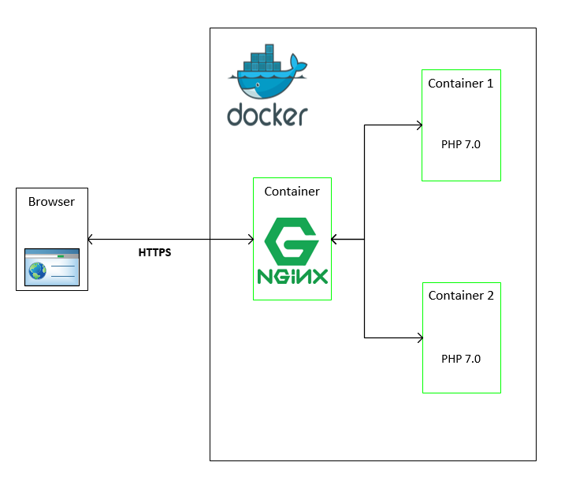

# Docker-Nginx-PHP
  
   How to set up Docker containers configured with PHP 7.0 and NGINX server acting as a reverse proxy.
   
   
   
 ### Prerequisites
  Installation of Docker and Docker-Compose on your host machine.
 
 ### Clone repository
  git clone https://github.com/RohanMohite/Docker-Nginx-PHP.git
 
 ### Build and run containers
  docker-compose up -d
  
### For more information please follow below link
https://devopsdevelopment.wordpress.com/2017/08/02/how-to-configure-docker-with-nginx-and-php-application/
